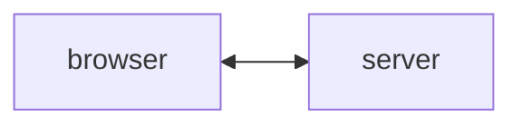

# Intro To Web Development

---

# Structure

- creating a personalized site
- as we learn we will add
  - features
  - interactivity
  - and *style*
- implement a project together
  - computer science club site
- today we will learn HTML

---
layout: fact
---

[where will write HTML today](https://stackblitz.com/edit/web-platform-zj7ksv?file=index.html)

---

# What is the "Web"

- usually a "webpage" is:
  - a file/collection of files stored on some other computer
  - accessed through the internet
- browser asks for file over the internet and computer sends it
- usually a file is HTML
  - can include both CSS and Javascript we will go over that in the next lessons


---

# State of the web

- early web was just html, css and js
- then there was databases and 

---

# HTML
- markup language
- structure your content
- browsers reads "markup"
- renders to your screen
---
layout: better-center
---

# HTML Element

::example::
```html
  <p>Hello world</p>
  
  <p
  class="small">
  Hello world
  </p>
```
---
layout: better-center
class: "example-small"
---

# Structure of HTML
::example::
```html
<!DOCTYPE html>
<html lang="en">
  <head>
    <meta charset="UTF-8" />
    <meta name="viewport" content="width=device-width" />
    <title>Template</title>
  </head>
  <body>
    <h1>Template</h1>
  </body>
</html>
```
---
layout: better-center
---

# Headers

::example::

```html
<h1>Hello world</h1>
<h2>Hello world</h2>
<h3>Etc</h3>
```
::task::
### Task:

- create an `h1` with your name in it
---
layout: better-center
---

# Paragraphs
::example::
```html
<p>smaller text goes here</p>
```
::task::
### Task:
- write one short thing about yourself under the title
---
layout: better-center
---

# Images
::example::
```html

```
::task::
### Task:
- find an image online
- add it to your site
---
layout: better-center
---

# Lists
::example::
```html
  <ul>
    <li>An item</li>
    <li>Another item</li>
  </ul>
  <ol>
    <li>Item one</li>
    <li>Item two</li>
  </ol>
```
::task::
### Task:
- create a rank of fruits
- create a list of programming languages
---
layout: better-center
---

# Links
::example::
```html
  <a href="https://example.com">
  Example link
  </a>
  <a href="/" target="_blank">
  Root of the site
  </a>
```
::task::
### Task:
- in a list
  - add a link to the mdn docs
  - and w3schools site
  - hint: look them up on google
